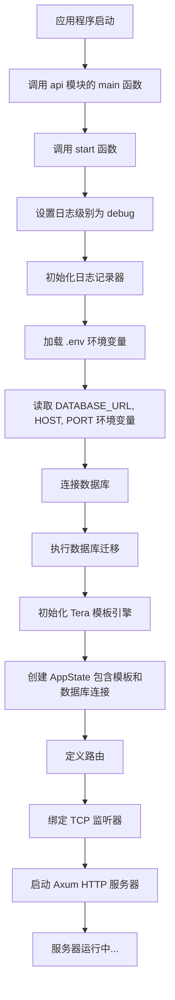

# web

## 整体构建

本项目是一个基于 Rust 语言的 Web 应用，使用 Axum 框架作为 HTTP 服务器，SeaORM 作为数据库 ORM 层。项目采用模块化工作区（workspace）结构，包含多个子模块。

### 项目结构

```
rs-web/
├── api/           # Axum API 服务实现
├── entity/        # 数据库实体定义
├── migration/     # 数据库迁移脚本
├── seeder/        # 数据库种子数据
├── service/       # 业务逻辑层
├── src/           # 主程序入口
└── Cargo.toml     # 工作区配置文件
```

### 模块详解

#### 1. api 模块

这是应用程序的核心部分，负责处理 HTTP 请求和响应。它使用 Axum 框架来定义路由和处理函数。主要功能包括：

- 初始化日志记录和环境变量加载
- 建立数据库连接并执行迁移
- 设置 Tera 模板引擎用于渲染 HTML 页面
- 定义路由及其对应的处理函数
- 提供静态文件服务（CSS、图片等）
- 启动 HTTP 服务器

#### 2. entity 模块

这个模块包含了数据库实体的定义，使用 SeaORM 来映射数据库表结构。目前包含：

- Post 实体：定义了博客文章的结构，包括 id、title 和 text 字段

这些实体被其他模块（如 service 和 api）用来进行数据库操作。

#### 3. migration 模块

该模块负责数据库的迁移管理，确保数据库结构与应用程序的要求保持同步：

- 创建 posts 表的迁移脚本
- 定义迁移的执行顺序
- 提供向上和向下迁移的功能

在应用程序启动时会自动运行这些迁移脚本。

#### 4. seeder 模块

该模块用于向数据库中插入初始数据，方便开发和演示：

- 向 posts 表中添加示例数据
- 提供清除种子数据的功能

#### 5. service 模块

这个模块封装了所有的业务逻辑和数据库操作：

- Query：负责数据查询操作，如按 ID 查找文章、分页查询文章等
- Mutation：负责数据修改操作，如创建、更新和删除文章

#### 6. src 目录

项目的主入口点，简单地调用 [api 模块中的 main 函数](./api/src/lib.rs) 来启动整个应用程序。

### 启动初始化流程图



### 构建流程

1. **环境准备**
   - 安装 Rust 工具链（edition 2024）
   - 安装数据库（MySQL/PostgreSQL等，根据 SeaORM 配置）
   - 配置 `.env` 文件，包含数据库连接信息

2. **依赖管理**
   - 项目使用 Cargo 工作区管理多个 crate
   - 主要依赖包括：
     - `axum`：Web 框架
     - `sea-orm`：数据库 ORM（从 Git 主干获取最新特性）
     - `tokio`：异步运行时
     - `tera`：模板引擎

3. **数据库设置**
   - 通过 `migration` 模块管理数据库结构变更
   - 应用启动时自动运行迁移脚本创建表结构

4. **应用启动**
   - 从 [src/main.rs](./src/main.rs) 调用 [api/src/lib.rs](./api/src/lib.rs) 中的 [main()](./api/src/lib.rs) 函数
   - 初始化日志、加载环境变量
   - 建立数据库连接并运行迁移
   - 启动 Axum HTTP 服务器

5. **功能模块**
   - Posts 管理：增删改查功能
   - 基于 Tera 模板引擎的前端界面
   - 静态文件服务（CSS、图片等）

## 注意

windows 中lldb中断点调试对tokio中支持不完全